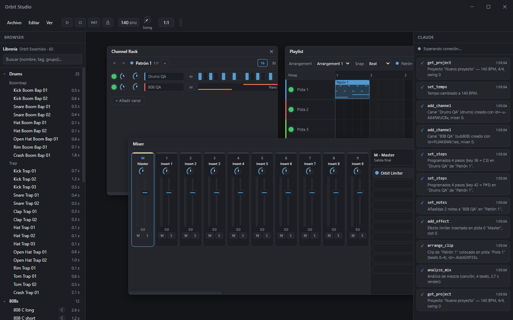
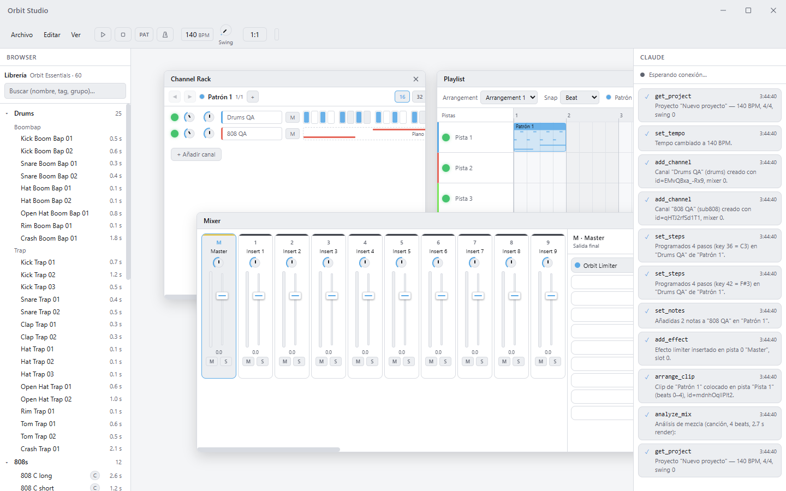
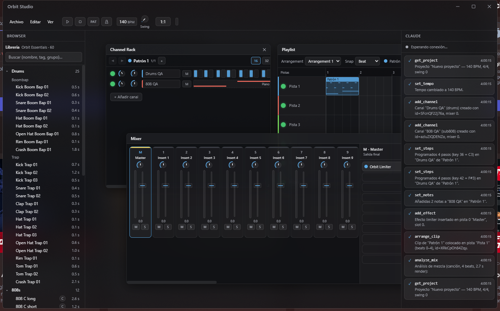

# Orbit Studio

**El DAW de Orbit.** Un estudio de producción musical completo, hecho desde cero:
secuenciador, piano roll, playlist, mixer con cadenas de efectos, síntesis propia,
librería de sonidos clasificada, colaboración en tiempo real y Claude integrado
como un productor más dentro del proyecto.



> La escena de arriba la montó **Claude en vivo** por el bridge MCP: canales,
> steps, 808 con slide, limiter en el master, clip en la playlist y análisis de
> mezcla — cada tool call aparece en su panel (derecha) mientras la UI se
> actualiza en tiempo real.

## Tres temas, mismo estudio

| Claro | Acrílico (blur DWM real) |
|---|---|
|  |  |

Minimalista, iconografía propia estilo Mac, semáforo de macOS opcional y
customizador integrado (acento, transparencia y tinte del vidrio, temas
guardables con nombre).

## Los cinco pilares

1. **Motor de audio propio** — DSP sample-accurate en un AudioWorklet: 6
   instrumentos (sustractivo, supersaw, FM, 808 con glide, drums sintetizados
   en 3 kits, sampler) y 14 efectos (EQ paramétrico, compresor con sidechain
   real, limiter lookahead, reverb, delay sync, auto-filter con LFO,
   mono-maker…), mixer de 26 pistas con routing libre y sends. El ADN sonoro
   viene del engine con el que ya producimos el catálogo de El Doctor.
2. **Flujo FL Studio completo** — Channel Rack con step sequencer (16/32/64),
   Piano Roll con slide notes, escalas y ghost notes, Playlist con clips y
   arrangements, editor de automatización con curvas de tensión, Mixer con 10
   slots de efectos por pista. Export offline a WAV 16/24/32, stems por pista
   y normalización a -14 LUFS.
3. **Librería clasificada** — pack de fábrica *Orbit Essentials* (60 sonidos
   generados por síntesis propia) con categorías, tags de género/tonalidad/BPM,
   búsqueda instantánea y preview renderizado por el propio kernel.
4. **Colaboración en tiempo real** — el proyecto es un log de comandos sobre
   CRDT (Yjs): salas por código de 6 letras, servidor propio con persistencia,
   convergencia sin conflictos y undo POR USUARIO (tu Ctrl+Z no deshace lo del
   otro).
5. **Claude dentro del estudio** — la app expone un servidor MCP con 20 tools
   (`.mcp.json` en el repo): Claude lee el proyecto, escribe notas, programa
   steps, ajusta la mezcla, añade efectos, renderiza y analiza LUFS/balance —
   todo por el mismo bus de comandos, visible en vivo y deshacible.

## Instalación

Descarga `Orbit-Studio-Setup-<versión>.exe` de la [última release](https://github.com/watskybelfort/Orbit-Studio/releases)
(Windows x64, instalación en un clic, pack de sonidos incluido). Para
regenerarlo: `npm run dist` en `apps/desktop`.

## Arranque rápido (desarrollo)

```bash
npm install
npm run dev        # Electron + Vite (la app)
npm run server     # servidor de colaboración (puerto 7900)
npm test           # 145 tests (core, engine, collab, claude-bridge, ui)
```

> Si tras `npm install` Electron no arranca (allow-scripts se salta su
> postinstall): `cd node_modules/electron && node install.js`.

**Claude como colaborador:** abre la carpeta con Claude Code y la app en
marcha; el `.mcp.json` del repo conecta el bridge (stdio → WS local 7855) y las
20 tools aparecen solas. Todo lo que haga Claude sale en su panel (menú Ver →
Panel de Claude).

## Estado

**v0.9.0 — "cierra la pista".** Ya se puede terminar un tema sin salir de
Orbit: **consolidar a audio** (los clips de una pista se renderizan con sus
efectos y quedan como un solo clip, en un undo), **grabar la salida de una
pista** del mixer mientras suena —con las perillas que muevas en esa pasada— a
WAV y a la playlist, **EQ rápido de 3 bandas y separación estéreo** por pista
(automatizables y con LFO como todo lo demás), y **altura arrastrable e icono**
por pista de la playlist.

Antes, v0.8 "la mezcla se mueve sola": menú de automatización y **LFO** en cada
perilla y fader, panel de LFOs y **grabación de movimientos de perillas** a
clips con la curva simplificada. Y el horizonte de v0.7: **time-stretch** de
clips, **SDK de plugins JS** ([docs/PLUGINS.md](docs/PLUGINS.md)) y **vista
Live por escenas** con lanzamiento cuantizado (F8). Qué entró en cada versión
está auditado línea a línea en [docs/FEATURES.md](docs/FEATURES.md).

## Documentación

| Documento | Qué contiene |
|---|---|
| [docs/PLAN.md](docs/PLAN.md) | Plan por fases y estado real |
| [docs/FEATURES.md](docs/FEATURES.md) | Catálogo completo de funciones (v0.1 / v0.x / v1+) |
| [docs/ARCHITECTURE.md](docs/ARCHITECTURE.md) | Arquitectura técnica del monorepo |
| [docs/THEMING.md](docs/THEMING.md) | Sistema de temas: oscuro, claro, acrílico, semáforo Mac |
| [docs/COLLAB.md](docs/COLLAB.md) | Colaboración en tiempo real |
| [docs/CLAUDE-INTEGRATION.md](docs/CLAUDE-INTEGRATION.md) | Claude como colaborador (MCP) |
| [docs/PLUGINS.md](docs/PLUGINS.md) | SDK de plugins JS (efectos de usuario) con ejemplo |

## Estructura

```
orbit-studio/
├─ apps/
│  ├─ desktop/        Shell Electron (ventana, acrílico DWM, IPC, bridge host)
│  └─ server/         Servidor de colaboración (rooms, persistencia)
├─ packages/
│  ├─ core/           Modelo de proyecto, bus de comandos, undo, formato .orbit
│  ├─ engine/         Motor de audio DSP (AudioWorklet + render offline)
│  ├─ ui/             Interfaz React (rack, piano roll, playlist, mixer, browser…)
│  ├─ collab/         Sesión Yjs + protocolo y-websocket
│  ├─ claude-bridge/  Tools MCP + executor + relay stdio⇄WS
│  └─ sound-library/  Pack de fábrica generado por síntesis + manifest
├─ tools/qa/          QA en vivo: driver CDP y beat de prueba por el bridge
└─ docs/              Toda la documentación
```
